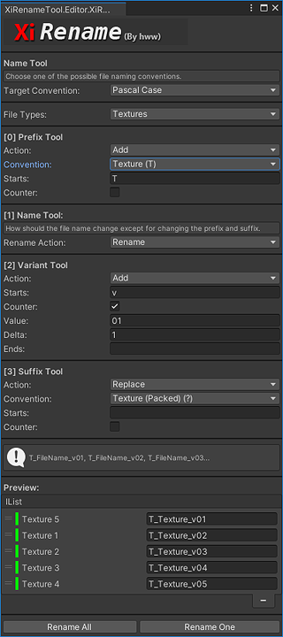
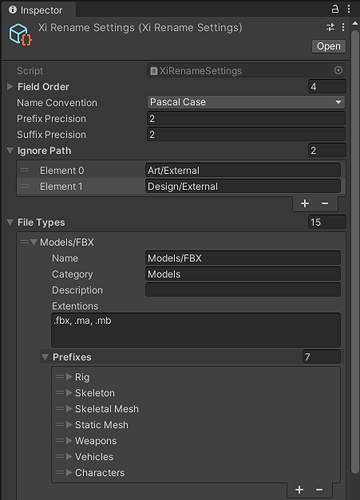

# XiRename _The renaming tool for Unity 3D_


[](https://github.com/hww/XiRename/actions/workflows/ci.yml)
[](https://openupm.com/packages/com.hww.xirename/)
[](https://github.com/hww/XiRename/blob/master/LICENSE)
[](https://github.com/semantic-release/semantic-release)



Simple asstes renaming tool by [hww](https://github.com/hww)

## Introduction




## Install

The package is available on the openupm registry. You can install it via openupm-cli.

```bash
openupm add com.hww.xigametool
```
You can also install via git url by adding this entry in your manifest.json

```bash
"com.hww.xigametool": "https://github.com/hww/XiGameTool.git#upm"
```
## TODO

- [x] Basic functionality
- [x] Configurabe and safe (no enum) the objects tagging
- [x] Update documentation
- [ ] The performance optimization
- [ ] Better redraw screen for Unity


